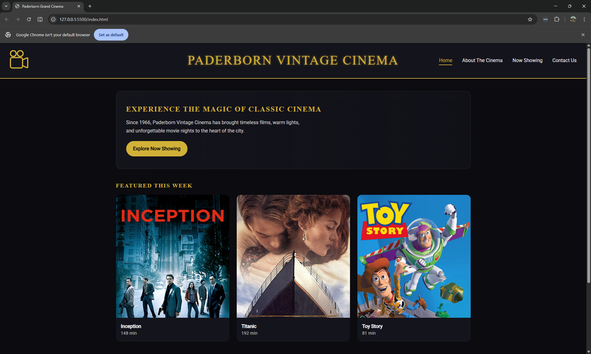
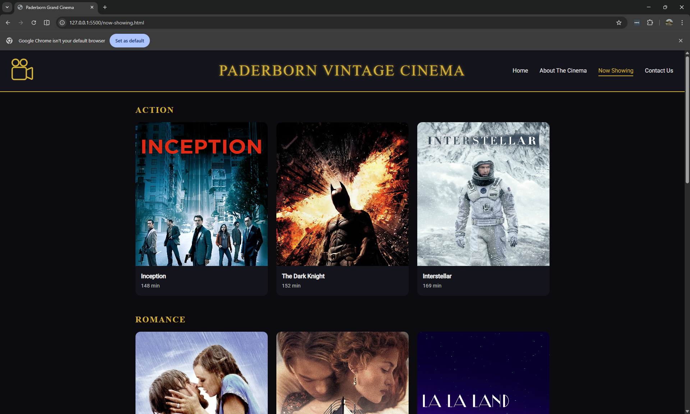
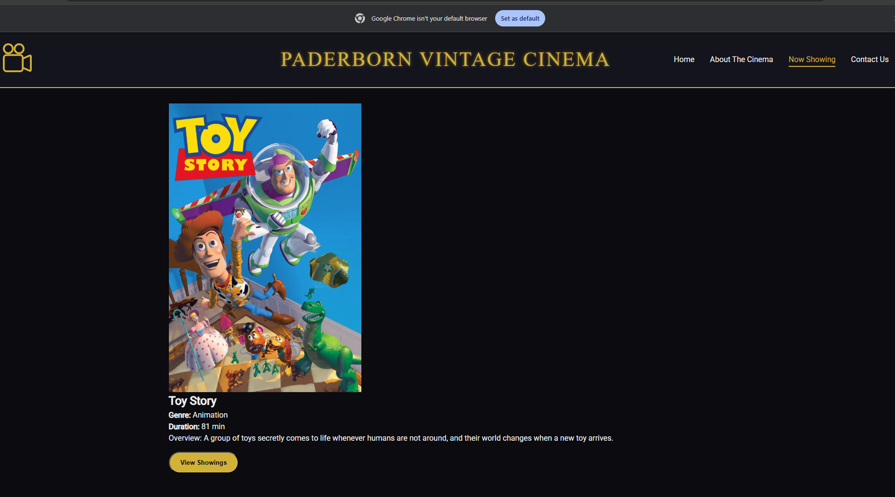
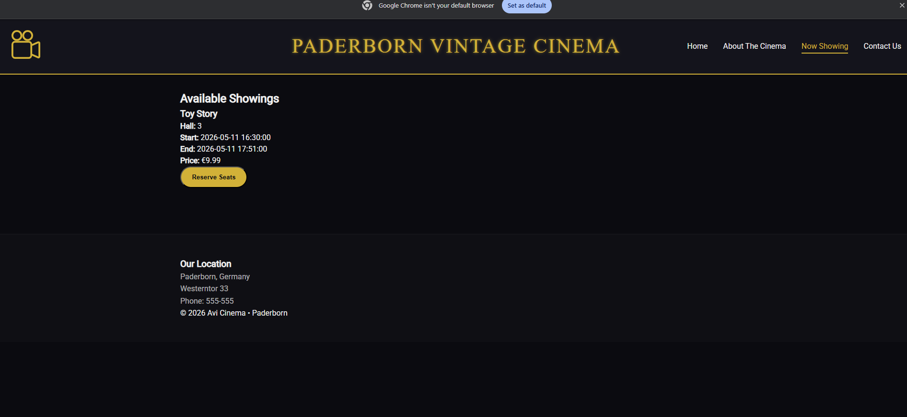
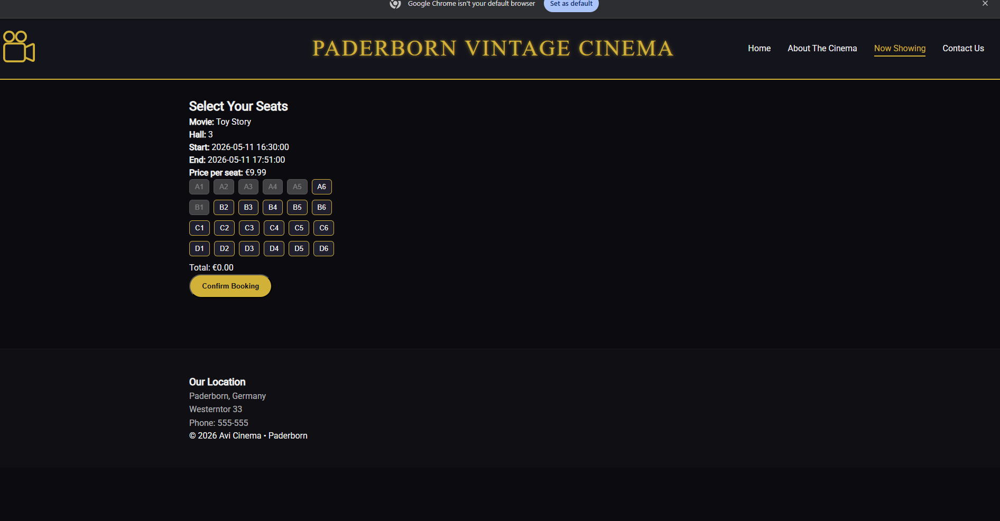
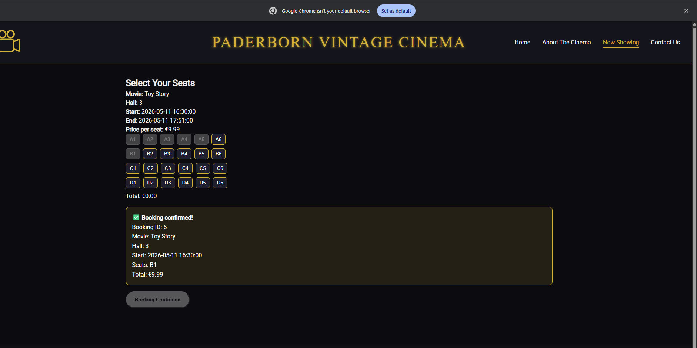
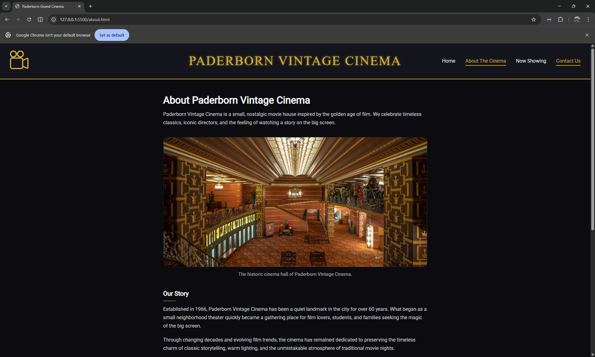
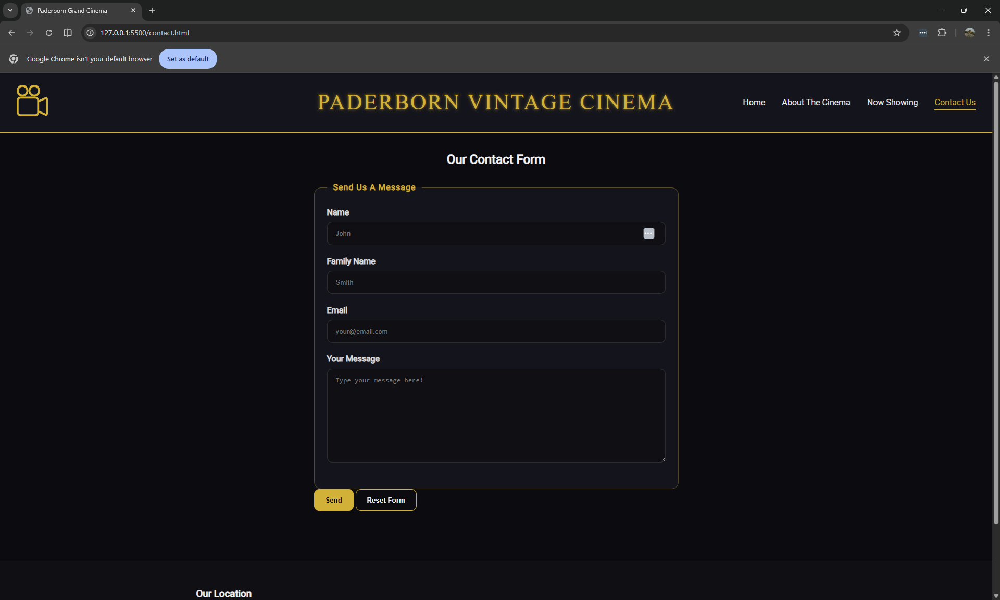

# 🎬 Paderborn Vintage Cinema Booking System

A full-stack cinema booking web application where users can browse movies, view showings, select seats, and confirm bookings.

---

## Features

- Browse movies by category
- View detailed movie information
- See available showings
- Select seats interactively
- Confirm booking with summary
- Responsive and modern UI (dark + gold theme)

---

## Technologies Used

- Frontend: HTML, CSS, JavaScript
- Backend: Python (Flask)
- Database: SQL Server
- API: RESTful endpoints (Flask)
- Other: pyodbc, flask-cors

---

## Application Flow

### 🏠 Home Page


### 🎞️ Movie List


### 🎬 Movie Details
)

### 🕒 Available Showings


### 💺 Seat Selection


### ✅ Booking Confirmation


### ✅ About Page


### ✅ Contact Page


---

## ⚙️ How to Run

1. Clone the repository:
```bash
git clone https://github.com/avishan/cinema-booking-app.git
